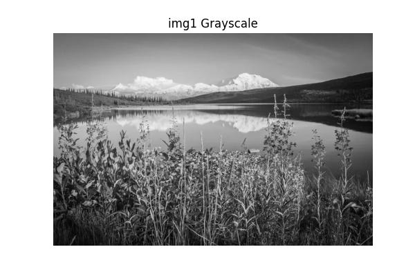
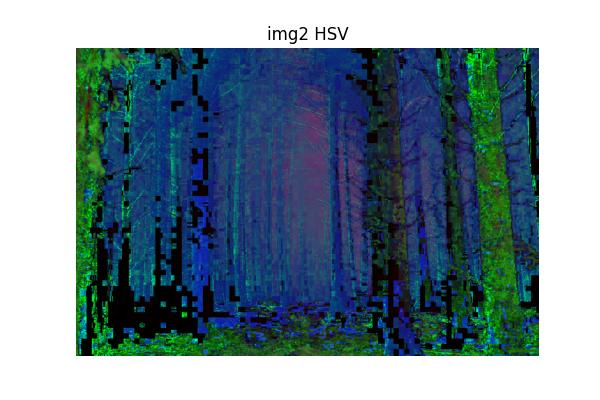
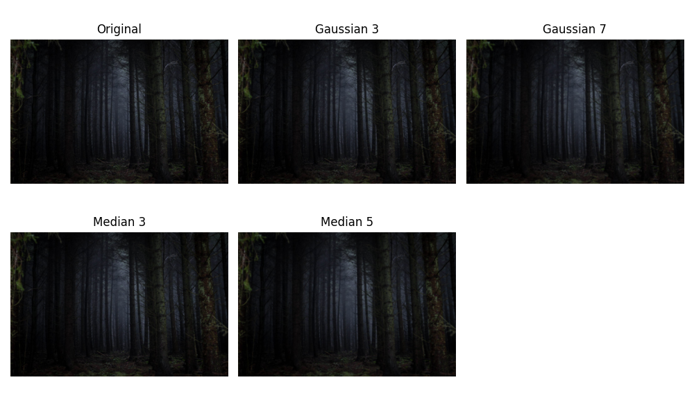

# **OpenCV Image Preprocessing Suite**

## **Table of Contents**
*   [Problem Statement](#problem-statement)
*   [Overall Project Goal](#overall-project-goal)
*   [Key Technologies and Libraries Used](#key-technologies-and-libraries-used)
*   [Preprocessing Pipeline & Visual Results](#preprocessing-pipeline--visual-results)
    *   [Initial Images](#initial-images)
    *   [Color Space Conversions & Histograms](#color-space-conversions--histograms)
    *   [Denoising Suite](#denoising-suite)
    *   [Edge Detection Suite](#edge-detection-suite)
    *   [Thresholding, Morphology & Contours](#thresholding-morphology--contours)
    *   [Performance Benchmarking](#performance-benchmarking)
    *   [Key Observations](#key-observations)
*   [Getting Started](#getting-started)
    *   [Prerequisites](#prerequisites)
    *   [Installation](#installation)
    *   [Running the Script](#running-the-script)
*   [Project Structure](#project-structure)
*   [Contributing](#contributing)
*   [Contact](#contact)

---

## **Problem Statement**
Image preprocessing is a fundamental step in almost all computer vision tasks. It involves transforming raw images into a more suitable format for subsequent processing, analysis, or model training. This suite demonstrates various essential image preprocessing techniques using OpenCV, providing a practical overview of common operations.

## **Overall Project Goal**
To provide a clear, executable demonstration of fundamental image preprocessing techniques using OpenCV and Matplotlib. The script showcases operations like color space conversions, denoising, edge detection, thresholding, morphological operations, and contour detection, with all results saved for easy review.

## **Key Technologies and Libraries Used**
*   **Python:** The primary programming language.
*   **OpenCV (`cv2`):** The core library for image processing operations.
*   **NumPy:** For efficient numerical operations and array manipulation.
*   **Matplotlib (`plt`):** For plotting histograms and visualizing image transformations.
*   **Pathlib:** For object-oriented filesystem paths.
*   **Time:** For basic performance benchmarking.

## **Preprocessing Pipeline & Visual Results**
This section details the various image preprocessing steps performed by the script, along with visual examples of the results. All generated images are saved in the `outputs/` directory.

### **Initial Images**
The script loads two input images from the `images/` directory for processing.
<div align="center">
    
    
</div>

### **Color Space Conversions & Histograms**
Images are converted to different color spaces (Grayscale, HSV, YCrCb) to highlight various image properties. Histograms of the grayscale images are also generated.

*   **Grayscale, HSV, YCrCb Conversions:**
    <div align="center">
        
        
        
    </div>
    <div align="center">
        
        
        
    </div>

*   **Grayscale Histograms:**
    <div align="center">
        
        
    </div>

### **Denoising Suite**
Various blurring and denoising filters are applied to reduce noise while preserving image features.

<div align="center">
    
    
</div>

### **Edge Detection Suite**
Common edge detection algorithms (Sobel, Laplacian, Canny) are applied to highlight image boundaries.

<div align="center">
    
    
</div>

### **Thresholding, Morphology & Contours**
Demonstrates image binarization using Otsu's method, morphological operations (opening, closing), and contour detection.

<div align="center">
    
    
</div>

### **Performance Benchmarking**
The script also includes basic benchmarking for some operations.
*   `img1 Gaussian(7x7): X ms`
*   `img1 Canny(100-200): Y ms`
*   `img2 Gaussian(7x7): X ms`
*   `img2 Canny(100-200): Y ms`

### **Key Observations**
*   Median blur preserved edges better on the noisy image.
*   Canny(100–200) gave clean edges, fewer false positives than 50–150.
*   Morphological closing after Otsu threshold filled gaps and improved contour detection.
*   Typical timings: Gaussian(7x7) around X ms; Canny(100-200) Y ms per 1080p image.

## **Getting Started**

### **Prerequisites**
*   **Python 3.8+**
*   **Git**

### **Installation**
1.  **Clone the repository:**
    ```bash
    git clone https://github.com/talha-shafique/OpenCV-Preprocessing-Pipeline
    cd OpenCV-Preprocessing-Pipeline
    ```
    *(Replace `your-username` and `your-repo-name` with your actual GitHub details)*
2.  **Create a virtual environment (recommended):**
    ```bash
    python -m venv venv
    # On Windows
    .\venv\Scripts\activate
    # On macOS/Linux
    source venv/bin/activate
    ```
3.  **Install dependencies:**
    ```bash
    pip install -r requirements.txt
    ```

## **Running the Script**
1.  **Prepare Input Images:** Create a folder named `images` in the same directory as `opencv_preprocessing.py`. Place at least two `.jpg` or `.png` image files inside this `images` folder.
2.  **Run the script:**
    ```bash
    python opencv_preprocessing.py
    ```
    This will generate an `outputs/` folder containing all the processed images and plots.

## **Project Structure**
```
.
├── images/                     # Input images for preprocessing
├── outputs/                    # Generated output images and plots
├── .gitignore                  # Specifies files/folders to ignore in Git
├── opencv_preprocessing.py     # Main preprocessing script
├── requirements.txt            # Python dependencies
└── README.md                   # This file
```

## **Contributing**
Contributions are welcome! If you have suggestions for improvements or new features, please open an issue or submit a pull request.

## **Contact**
*   GitHub: https://github.com/talha-shafique
*   Email:  talha.shafique126@gmail.com

---
